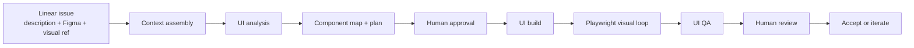
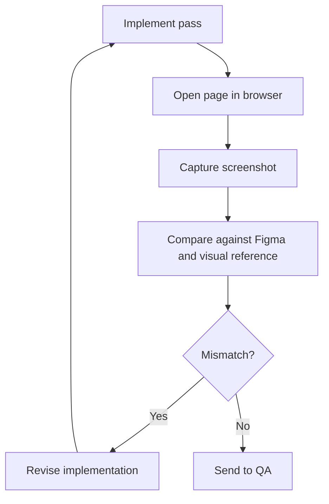

# Supervised UI Workflow

This document describes the current direction for this repo.

The repo is now a `Claude Code`-first setup for supervised `UX/Figma -> production UI` work.

## Core Principle

Use this sentence as the operating rule:

`Linear holds the task and milestones. Claude Code does the work.`

That means:

- `Linear` stores requirements, references, clarifications, and milestone updates
- `Claude Code` does the analysis, planning, implementation, QA, and iteration
- humans approve the plan and the final visual result
- `Playwright` is mandatory for visual implementation work

---

## What This Repo Is

This repo is a workflow setup, not a full orchestration product.

It contains:

- project memory in `CLAUDE.md`
- project settings in `.claude/settings.json`
- project commands in `.claude/commands/`
- project subagents in `.claude/agents/`
- project standards in `.claude/memory/standards/`
- project rules in `.claude/rules/`
- shared MCP configuration in `.mcp.json`

It does not contain:

- a TUI
- a standalone backend runtime
- a generalized agent runtime
- a deep multi-stage ticket execution engine

---

## Official Claude Code Model

The repo is aligned to the official Claude Code project structure:

- `CLAUDE.md`
  Team-shared project memory auto-loaded by Claude Code
- `.claude/settings.json`
  Shared project settings
- `.claude/commands/`
  Project slash commands
- `.claude/agents/`
  Project subagents with YAML frontmatter
- `.mcp.json`
  Project-shared MCP server configuration

This is the supported shape we should build around.

---

## Operating Model

### Linear

Linear is the durable control plane.

Each issue should contain:

- product requirement
- description
- Figma reference
- visual reference code or screenshots
- acceptance criteria
- scope / route / screen
- constraints or non-goals
- clarifying comments

Linear should also receive:

- plan-ready milestone
- blocked / needs-input milestone
- ready-for-review milestone
- final summary and documentation

### Claude Code

Claude Code is the working environment.

It should:

- read the issue and comments
- inspect Figma and visual references
- inspect existing reusable components and tokens
- produce a component map and plan
- build the first pass
- run Playwright during implementation
- produce QA findings and review artifacts

### Local project memory

The repo-local memory should preserve:

- standards
- planning notes
- analysis
- screenshots and visual findings
- iteration notes

---

## Required Inputs

For the default UI workflow, the input metadata is:

- `Figma reference`
- `Description`
- `Visual reference code or screenshots`

These are attached to or referenced from the Linear issue.

This is enough to start supervised UI work if acceptance criteria and scope are also present.

---

## End-To-End Workflow

### Step 1: Context assembly

Claude gathers:

- Linear issue and comments
- Figma metadata and frame image
- visual reference code or screenshots
- relevant design-system standards
- relevant existing repo components

### Step 2: UI analysis

Claude produces:

- requirement summary
- layout summary
- reusable component map
- token guidance
- missing components or gaps
- implementation plan
- open questions

### Step 3: Human approval

The operator approves:

- the component mapping
- the implementation approach
- any known deviations

No build should start before this.

### Step 4: UI build

Claude implements the approved plan with these rules:

- reuse existing components first
- use tokens first
- avoid unnecessary custom CSS
- keep changes aligned with Queen One conventions

### Step 5: Playwright visual loop

Playwright is mandatory for visual work.

The build loop is:

### Step 6: UI QA

QA checks:

- token usage
- reusable component usage
- unnecessary custom CSS
- visual drift
- obvious accessibility issues
- new components that need justification

### Step 7: Human review

The operator reviews:

- preview
- screenshots
- component usage
- deviations
- QA findings

Then either:

- accepts
- requests another pass
- narrows scope
- rejects the output

---

## Project Commands

The project command surface is intentionally small.

### `/qo-ui-kickoff`

Use to:

- resolve the issue inputs
- gather context
- verify the task is ready for analysis

### `/qo-ui-analyze`

Use to:

- build the component map
- identify token usage
- identify gaps
- produce the implementation plan

### `/qo-ui-build`

Use to:

- implement the approved plan
- run Playwright during implementation
- gather visual evidence

### `/qo-ui-qa`

Use to:

- run standards and visual QA
- produce pass / warn / fail findings

### `/qo-ui-report`

Use to:

- summarize the work
- summarize reused and new components
- summarize deviations
- prepare a Linear-ready milestone or final update

---

## Project Subagents

This repo keeps only three project subagents.

### `ui-analysis-agent`

Focus:

- requirement analysis
- Figma understanding
- visual-reference understanding
- component and token mapping
- gap identification

### `ui-build-agent`

Focus:

- approved UI implementation
- token-correct code
- reusable component usage
- Playwright-backed visual iteration

### `ui-qa-agent`

Focus:

- token compliance
- reusable component compliance
- unnecessary CSS
- visual drift
- review findings

This agent is a reviewer, not a builder.

---

## MCP Setup

The shared project MCPs are:

- `Linear`
- `Figma`
- `GitHub`
- `Playwright`
- `Mermaid`

### Intended use

#### Linear

Use for:

- issue intake
- requirement reading
- comment reading
- milestone and final updates

#### Figma

Use for:

- frame metadata
- styles
- frame images
- layout and token understanding

#### GitHub

Use for:

- repo context
- component inventory lookup
- later PR workflows if needed

#### Playwright

Use for:

- browser rendering
- screenshots
- visual verification during implementation

This is essential for design and frontend work.

#### Mermaid

Use for:

- documenting pipelines
- explaining flows
- generating visual process diagrams

Mermaid is for visualization and planning, not for the live operator runtime.

---

## Guardrails

These are hard rules for the workflow.

### Before build

- no build before analysis
- no build before component map
- no build before human approval

### During build

- reuse existing components first
- use design tokens first
- avoid unnecessary custom CSS
- use Playwright during the build loop

### Before handoff

- no handoff without preview evidence
- no handoff without screenshots
- no handoff without reused components list
- no handoff without new components list
- no handoff without deviations list
- no handoff without QA findings

### Before done

- no `Done` without human visual review

---

## Why This Is Safer

This workflow is safer because it optimizes for supervised convergence instead of autonomy.

The system assumes:

- the model will not get everything right in one pass
- visual work requires iteration
- design-system compliance must be checked explicitly
- the human must retain judgment authority

Success means:

- the first pass is good enough to review
- each iteration improves the result
- the output is inspectable
- nothing is silently shipped

---

## V1 Rollout Plan

### 1. Define the Linear template

Standardize one UI issue format with:

- title
- product requirement
- Figma URL
- visual reference code or screenshots
- acceptance criteria
- scope / route / screen
- non-goals / constraints

### 2. Use the project commands

Adopt the `qo-ui-*` command flow for every non-trivial UI task.

### 3. Keep the subagent set small

Do not reintroduce a large PM-led multi-agent graph for normal UI work.

### 4. Make Playwright non-optional

No visual task should complete without browser-based verification.

### 5. Keep Linear updates high-signal

Update Linear at milestones, not at every micro-step.

---

## Current Recommendation

Use this repo as a supervised Claude Code workflow setup.

First prove that this narrow workflow is useful:

`Linear issue + Figma + visual reference -> Claude analysis -> approved plan -> Claude build with Playwright -> QA -> human review`

If that loop works consistently, then it can later be packaged into a richer operator experience for PMs or less technical designers.
