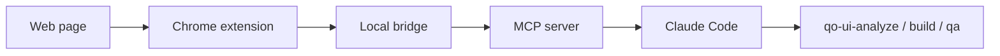

# UI DOM Inspector

This document defines the `UI DOM Inspector` initiative.

It is a browser-side inspection layer for supervised UI work.

Its purpose is to give Claude Code better eyes on the real rendered page by combining:

- screenshots
- DOM inspection
- computed styles
- element geometry
- component hints
- token diagnostics

This is designed to work with the current `qo-ui-*` workflow, not replace it.

---

## Why This Exists

Playwright is already useful for:

- opening pages
- interacting with the browser
- taking screenshots

But visual frontend work needs more than screenshots alone.

The agents also need:

- the actual DOM structure
- computed styles
- selected-element details
- component diagnostics
- token diagnostics

The `UI DOM Inspector` adds that live inspection layer.

---

## What It Should Do

The inspector should support:

### 1. Lightweight screenshots for LLM ingestion

- capture the visible tab
- optionally crop to a selected element or region
- compress screenshots to lighter JPEG or WebP variants
- preserve useful visual fidelity while reducing file size

### 2. Element inspection

For a selected element, expose:

- selector
- tag
- classes
- role
- text content
- bounds and position
- parent / child relationships
- computed styles

### 3. Visual diagnostics

- show a live overlay on the page
- display spacing, colors, typography, and box model
- flag likely token mismatches
- flag likely custom CSS
- flag likely reusable component candidates

### 4. Structured export to agents

The inspector should export structured JSON to the agent system, not just screenshots.

### 5. Support the existing workflow

It should help:

- `ui-analysis-agent`
- `ui-build-agent`
- `ui-qa-agent`

inside the current `qo-ui-*` command flow.

---

## Core Architecture



### Layer roles

#### Chrome extension

Responsible for:

- DOM access
- computed style access
- overlay rendering
- screenshot capture triggers
- selected-element inspection

#### Local bridge

Responsible for:

- receiving structured data from the extension
- persisting temporary session state
- exposing a local API to the MCP server

#### MCP server

Responsible for:

- making the inspector available as Claude tools
- exposing stable tool names and JSON outputs

#### Claude Code

Responsible for:

- consuming inspector data during analysis, build, and QA
- combining it with Linear, Figma, GitHub, and Playwright context

---

## Recommended V1 Scope

Build only the smallest useful version first.

### V1 features

- select element mode
- visible-tab screenshot capture
- selected-element crop capture
- compressed screenshot output
- computed-style export
- bounding box export
- DOM ancestry export
- basic token diagnostics
- basic component hinting
- MCP tools for inspection and snapshot retrieval

### Do not build yet

- perfect React component identity
- full token provenance tracing back to source files
- collaborative multi-user session management
- autonomous visual fixing
- a rich web dashboard

---

## V1 Data Model

### Selected element inspection

```json
{
  "page": {
    "url": "http://localhost:3000/settings"
  },
  "selectedElement": {
    "selector": "[data-qo-id='primary-cta']",
    "tag": "button",
    "role": "button",
    "text": "Save changes",
    "bounds": {
      "x": 240,
      "y": 612,
      "width": 180,
      "height": 48
    },
    "computedStyles": {
      "backgroundColor": "rgb(119, 0, 238)",
      "borderRadius": "200px",
      "fontFamily": "Poppins",
      "fontSize": "16px",
      "paddingTop": "12px",
      "paddingLeft": "20px"
    },
    "ancestry": [
      "main",
      "section.settings-footer",
      "div.actions",
      "button.primary"
    ],
    "componentHints": [
      "Button",
      "Primary CTA"
    ],
    "tokenDiagnostics": [
      {
        "property": "backgroundColor",
        "status": "matched",
        "token": "violet.400"
      },
      {
        "property": "borderRadius",
        "status": "matched",
        "token": "buttonCorner"
      }
    ]
  }
}
```

### Snapshot result

```json
{
  "pageUrl": "http://localhost:3000/settings",
  "capturedAt": "2026-05-01T14:42:00Z",
  "visibleScreenshot": "artifacts/page-20260501-144200.jpg",
  "selectedCrop": "artifacts/primary-cta-20260501-144200.jpg",
  "compression": {
    "format": "jpeg",
    "quality": 70
  }
}
```

---

## MCP Tool Plan

The MCP server should expose a small set of tools.

### `ui_dom_inspector_get_selected_element`

Returns:

- selected element metadata
- computed styles
- bounds
- ancestry
- diagnostics

### `ui_dom_inspector_capture_snapshot`

Returns:

- visible screenshot path
- optional selected crop path
- compression metadata

### `ui_dom_inspector_get_page_structure`

Returns:

- summarized DOM structure
- likely component regions
- layout hints

### `ui_dom_inspector_get_visual_diagnostics`

Returns:

- token diagnostics
- component hints
- style mismatches
- layout warnings

---

## How It Integrates With The Current Workflow

### `qo-ui-kickoff`

No direct dependency yet.

Its job remains:

- resolve the task inputs
- confirm the issue is ready

### `qo-ui-analyze`

Should use the inspector to:

- inspect the existing page structure
- inspect specific reference regions
- gather computed styles
- improve component mapping

### `qo-ui-build`

Should use the inspector to:

- inspect selected elements during the build loop
- verify styles and spacing
- capture compressed screenshots for comparison

### `qo-ui-qa`

Should use the inspector to:

- audit token usage
- audit likely component reuse
- flag unnecessary custom CSS
- verify suspicious regions precisely

### `qo-ui-report`

Should use inspector outputs as evidence:

- screenshots
- selected element details
- diagnostics summaries

---

## Difficulty Assessment

### V1 difficulty

Moderate.

This is realistic to build.

### Easier parts

- content script DOM inspection
- computed style extraction
- box model extraction
- simple in-page overlay
- visible-tab capture
- JPEG compression

### Medium parts

- local bridge
- MCP wrapper
- token matching heuristics
- component hint heuristics

### Harder parts

- exact React component identity
- full design-token provenance
- zero-noise component inference
- complex multi-tab orchestration

---

## Recommended Build Order

### Phase 1

Create the extension scaffold:

- manifest
- service worker
- content script
- devtools / popup placeholder if needed

### Phase 2

Add selected-element inspection:

- hover / click selection mode
- computed styles
- bounds
- ancestry

### Phase 3

Add screenshot capture:

- visible-tab capture
- selected-element crop
- JPEG compression

### Phase 4

Add diagnostics:

- token hints
- component hints
- visual mismatch flags

### Phase 5

Add local bridge + MCP wrapper:

- local session state
- MCP tools
- Claude integration

---

## V1 Success Criteria

The inspector is successful if:

- an agent can inspect a selected element and get useful structured metadata
- screenshot artifacts are small enough for practical ingestion
- the build and QA agents can use the inspector to catch visual or styling drift
- the workflow becomes more trustworthy for frontend work

---

## Recommendation

Build this as a focused technical layer, not as a giant product.

The first version should be:

- small
- inspectable
- MCP-friendly
- tightly integrated with the current `qo-ui-*` workflow

That is enough to make the agents meaningfully better at visual UI work.

---

## Initial Setup Plan

The repo now includes a first v1 skeleton:

- Chrome extension scaffold
- local bridge scaffold
- MCP server scaffold
- setup documentation

### Next implementation steps

1. install `ui-dom-inspector` dependencies
2. run the local bridge
3. run the MCP server
4. load the Chrome extension unpacked
5. verify page-state capture
6. verify screenshot capture
7. enable the MCP entry in the project config when ready

### Why this is safe

The inspector is not enabled in the repo-wide `.mcp.json` yet.

That means:

- the current Claude workflow remains stable
- the inspector can be tested in isolation
- you can let Claude Code review and iterate on it before enabling it globally
