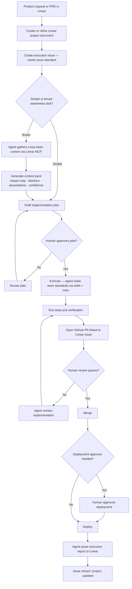
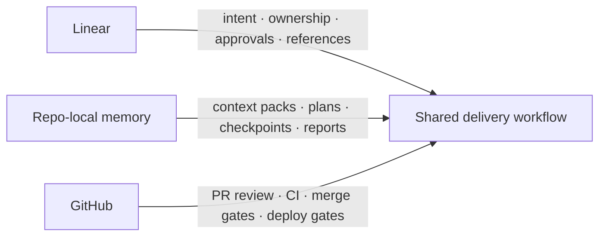
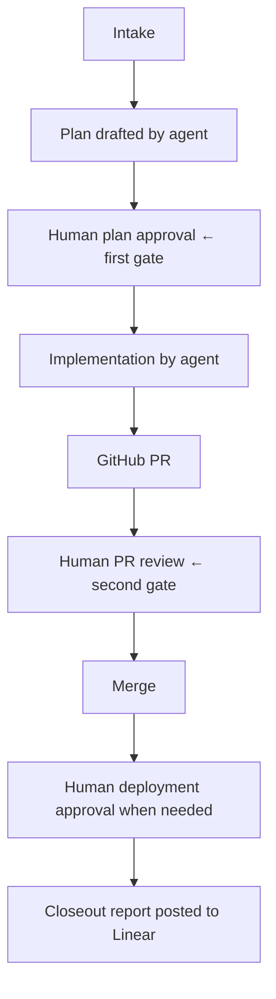
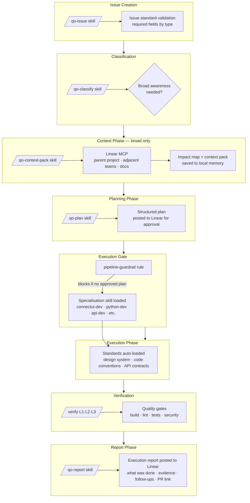
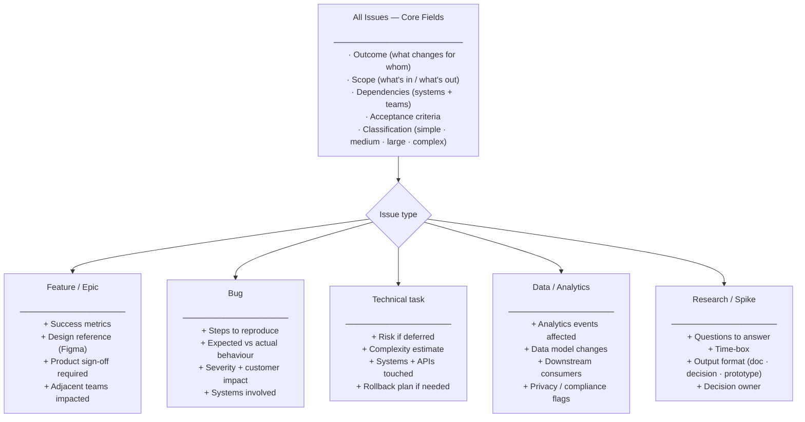
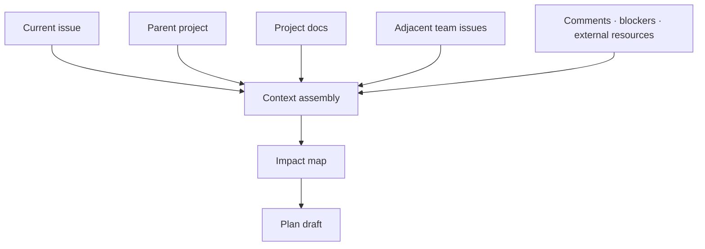
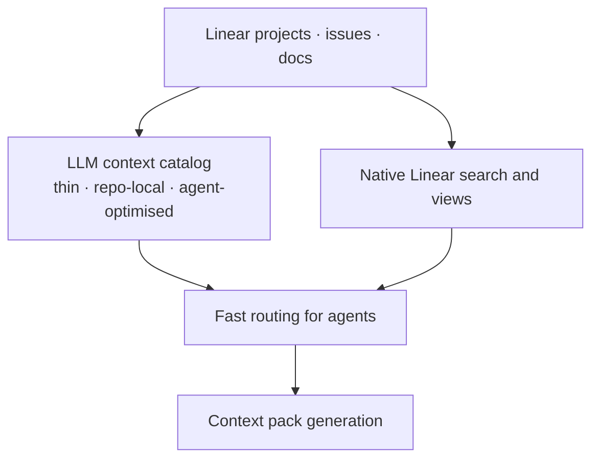
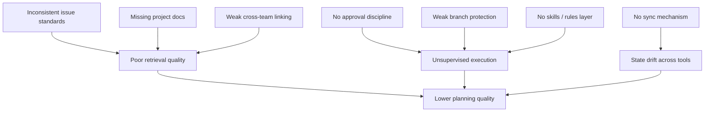
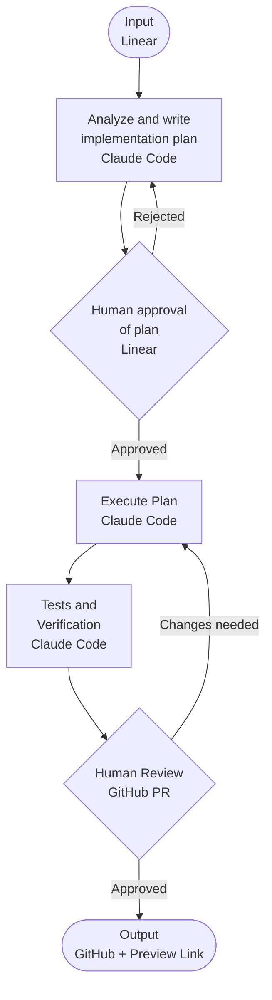
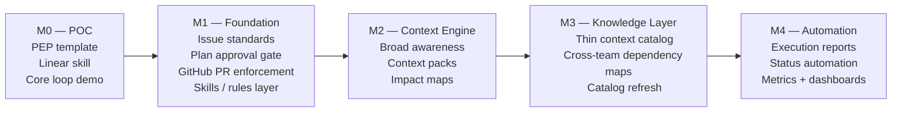

# Flow Diagrams

## End-to-End Delivery Flow



---

## Systems Of Record



---

## Human Control Points



---

## Skills & Rules Layer

Each pipeline stage is wrapped by a skill. Rules auto-inject context based on file paths and issue type. This is what makes the pipeline agentic rather than a documented checklist.



---

## Issue Standards Model

Not a rigid template — a set of required fields with quality criteria, varying by issue type. Agents validate completeness before planning; humans validate intent before approving.



---

## Agent Context Loading

How agents load the right knowledge for the task — before writing a single line of code.

```mermaid
flowchart LR
    A[Issue loaded] --> B[/qo-classify/]

    B -->|simple| C[Load team rules only]
    B -->|broad| D[/qo-context-pack/ via Linear MCP]

    C --> R[team-specific rules auto-injected<br/>by path matching]
    D --> E[Pull: parent project · adjacent issues · linked docs · comments]
    E --> F[Impact map · blockers · assumptions · confidence level]
    F --> R

    R --> G{Team / domain?}
    G --> H[Frontend: connectui.md · orion.md · state.md · routing.md]
    G --> I[Backend: api-standards · data-models · contracts]
    G --> J[Data: analytics-events · schema · privacy]
    G --> K[DevOps: infra · deploy · rollback]

    H & I & J & K --> L[Agent begins planning with full context]
```

---

## Broad Awareness Flow



---

## Skills Gap — Exists vs Needs Building

What cc-qo-skills already provides vs what the pipeline needs to build.

```mermaid
flowchart TD
    subgraph EXISTS["Already exists in cc-qo-skills"]
        E1[connectui-dev: standards loading before code]
        E2[qo-bug: structured Linear ticket creation]
        E3[qo-prototype: Figma-to-code with design system]
        E4[qo-pr: structured PR description]
        E5[verify L1/L2/L3: quality pipeline]
        E6[Path rules: connectui · orion · state · routing · firebase]
        E7[qo-sync: keep rules aligned across tools]
    end

    subgraph BUILD["Needs to be built for the pipeline"]
        B1[/qo-issue/ — issue standard for all types]
        B2[/qo-classify/ — simple vs broad threshold]
        B3[/qo-context-pack/ — broad awareness + impact map]
        B4[pipeline-guardrail rule — no approved plan → no code]
        B5[/qo-report/ — structured execution report to Linear]
        B6[issue-standards rule — field requirements by type]
        B7[team-context rule — adjacent team routing by domain]
    end

    subgraph ADAPT["Adapt / extend from existing"]
        A1[qo-bug → foundation for qo-issue]
        A2[connectui-dev → pattern for standards-loading in all skills]
        A3[qo-sync → model for keeping standards aligned with Linear]
    end
```

---

## Indexing Model



---

## Failure Modes



---

## Pipeline Module Architecture

How the cc-pipeline module relates to the rest of the toolchain. Teams install both modules; each handles a distinct layer.

```mermaid
flowchart TD
    subgraph INSTALL["Team installs"]
        M1[cc-pipeline module\n/pd-* commands\npd- skills + rules\nLinear MCP wired]
        M2[cc-qo-skills module\n/qo-* commands\nexecution skills\nConnectUI rules]
    end

    subgraph PIPELINE["cc-pipeline handles"]
        P1[/pd-start/ — classify issue]
        P2[/pd-scope/ — Haiku agent scoping]
        P3[/pd-plan/ — draft + post plan to Linear]
        P4[pd-guardrail rule — block until plan approved]
        P5[/pd-report/ — post execution report to Linear]
    end

    subgraph EXEC["cc-qo-skills handles"]
        E1[connectui-dev — load design system + code standards]
        E2[verify L1/L2/L3 — build · lint · tests]
        E3[qo-pr — PR description]
        E4[qo-prototype — Figma to code]
    end

    subgraph LINEAR["Linear — start and end"]
        L1[Issue with information standard]
        L2[Plan comment — awaiting approval]
        L3[Plan Approved status]
        L4[Phase transition updates]
        L5[Execution report]
    end

    M1 --> PIPELINE
    M2 --> EXEC
    P1 --> P2 --> P3 --> L2
    L2 --> L3
    L3 --> P4
    P4 --> EXEC
    EXEC --> P5
    P5 --> L5
    L1 --> P1
```

---

## M0 — Simplified POC Loop

The minimum viable version. Two human gates, no context packs, no Haiku scoping. Tests the core concept and builds the business case.



---

## Maturity Path


