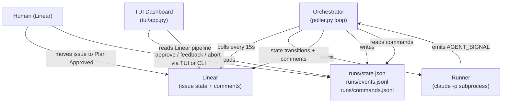

# How Resonance Works

Technical reference for the implemented system. Target audience: a developer joining the project who wants to understand the full picture in one read.

---

## Overview



The orchestrator is a blocking loop started by `./onair.sh` and run in the background. The TUI is a Textual application in the foreground of the same shell. They share no in-process state — all coordination goes through files in `runs/`.

---

## The Four Layers

### 1. Linear — intent layer

Linear holds the canonical state of every issue. The orchestrator reads from and writes to Linear but never treats its own local state as more authoritative than what Linear says. Key operations:

- **Polling**: `get_eligible_issues()` queries issues in the configured `eligibility_state` (default: "Plan Approved").
- **Fail-closed re-check**: before starting any run, `get_issue()` re-fetches the issue to confirm the state hasn't changed since the poll.
- **State transitions**: `set_issue_state()` moves issues through In Progress → Agent Feedback Needed → Human Review → Done/Todo.
- **Comments**: `post_comment()` posts structured updates at key lifecycle moments (run start for plan issues, human_input_needed, ready_for_review, retry, failure).
- **Feedback extraction**: `get_issue_with_comments()` fetches all comments when resuming after Human Review; new comments since the last check are injected as feedback.

All API calls go to `https://api.linear.app/graphql`. The client uses `httpx` with a 30-second timeout. State names are resolved to UUIDs and cached per team.

### 2. Orchestrator — execution layer

The main loop is `Poller.run_forever()` in `orchestrator/poller.py`. Each tick (`_tick()`) runs four steps in order:

1. `_advance_runners()` — polls all active `Runner` objects. If a runner has finished, removes it from the active dict and calls `_handle_result()`.
2. `_process_commands()` — reads `runs/commands.jsonl` for pause/abort/feedback/approve commands written by the CLI or TUI.
3. `_check_human_feedback_resumes()` — scans runs in `waiting_human` or `needs_input` status. If the Linear state is "Agent Feedback Needed", extracts new comments and calls `_retry_run()`.
4. Fetch new eligible issues from Linear and start runs if concurrency slots are available.

Every `reconcile_interval_seconds` (default: 120s), `_reconcile()` cross-checks all active local runs against Linear. If an issue has moved to Done or Cancelled, the local run is stopped and archived, and the worktree is removed.

### 3. Claude CLI workers — agent layer

Each run is a `Runner` instance. `Runner.start()` builds the `claude` command and launches it with `subprocess.Popen`:

```
claude -p "<prompt>" \
  --output-format stream-json \
  --verbose \
  --permission-mode bypassPermissions \
  --name agent-<issue-id>-iter<N> \
  --plugin-dir ../../.claude/cc-pipeline \
  --plugin-dir ../../.claude/cc-qo-skills \
  --mcp-config ../../.mcp.json
```

The process runs in the worktree directory (`workspaces/<team-prefix>/<issue-id>/`). stdout is merged with stderr and consumed by a background thread (`_consume_stdout`). Every line is:
- Attempted as stream-json parse. Text events and tool events are forwarded to the event log.
- Scanned for `AGENT_SIGNAL:` via regex regardless of whether JSON parsing succeeded.

`Runner.poll()` returns a `RunResult` when the process exits (detected by the `_done` threading event being set by the stdout consumer). The result carries the last signal seen and any artifacts extracted from it.

Stall detection: `is_stalled(stall_seconds)` compares `time.monotonic()` against `_last_output_at`. The poller kills and retries stalled runners.

**Plan issues** receive a different prompt from `orchestrator/planner.py`. The Planning Agent uses the Linear MCP tools to create phase issues, moves them to Plan Approved, writes a `plan.md` to local memory, posts a summary comment on the parent, and emits `plan_decomposed`.

**Execution issues** receive the prompt from `runner.build_prompt()`. The prompt contains:

1. **Agent persona** — task-type-specific role declaration (see [QO Worker Context](#qo-worker-context)).
2. **Issue details** — title, description, task type, iteration number.
3. **Skills Available** — numbered list of available slash-command skills with workflow guidance for this task type.
4. **Prior Feedback** — accumulated human feedback from previous iterations (iteration > 1).
5. **Required Artifacts** — list of artifacts the agent must produce.
6. **Handoff Protocol** — where to write `runs/memory/<issue-id>/handoffs/iter-N.md`.
7. **Before Signalling** — instructions to update the Linear issue description and post a structured review comment before any AGENT_SIGNAL.
8. **Signal Protocol** — exact format for `human_input_needed` and `ready_for_review`.

On retry (`_retry_run()`), the prompt also includes `prior_feedback` (all accumulated feedback texts) and a `memory_brief` string loaded from `runs/memory/<issue-id>/` by `orchestrator/memory.py`.

### 4. TUI dashboard — observation layer

`tui/app.py` is a Textual application (`ResonanceDashboard`). It reads `runs/state.json` and `runs/events.jsonl` on a 2-second refresh interval, and polls Linear independently on a 30-second background thread (`_LinearPoller`).

The layout is fixed:
- **Header bar** (1 line): orchestrator health (checks PID file), running/waiting/failed counts.
- **Attention section** (hidden when empty): items requiring human action — runs in `waiting_human` and Linear issues in Human Review state.
- **Active Runs table**: all runs with status `running`, `waiting_human`, `needs_input`, or `paused`. Shows issue ID, status with spinner for running, task type, attempt counter, detail text, elapsed time.
- **Linear Pipeline table**: issues fetched from Linear in any active pipeline state. Sorted by pipeline order (In Progress first, then Agent Feedback Needed, Human Review, Plan Approved).
- **Performance section**: success rate gauge, completed/failed/retried counts over 24h, 12-hour sparkline of run starts, average run duration.
- **Event Stream**: last 60 events from `runs/events.jsonl`, color-coded by event type. Toggle to raw log view with `v`.

All actions (approve, feedback, abort) write to `runs/commands.jsonl` via `orchestrator.state.post_command()`. The orchestrator picks them up on its next tick.

---

## Workflow States (Linear)

| State | Who transitions to it | Orchestrator behavior on seeing it |
|---|---|---|
| Todo | Human / orchestrator on failure | Not eligible — ignored |
| Ready for Planning | Human | Not eligible — ignored |
| Plan Proposed | Human / agent | Not eligible — ignored |
| Plan Approved | Human | **Eligible** — orchestrator picks up on next poll |
| In Progress | Orchestrator | Run is active — no new run started |
| Agent Feedback Needed | Orchestrator (on `human_input_needed`) or human (to resume after Human Review) | Checked by `_check_human_feedback_resumes`; if a local run is in `waiting_human`/`needs_input`, extracts new comments and resumes |
| Human Review | Orchestrator (on `ready_for_review`) | Local run in `waiting_human`; no automatic action — human must accept or send feedback |
| Done | Human | Reconciliation stops the local run and removes the worktree |
| Cancelled | Human | Reconciliation stops the local run and removes the worktree |

---

## Issue Labels

Labels are applied in Linear before moving an issue to Plan Approved. They determine task type, which controls the agent's skills, MCP servers, and required artifacts.

Classification priority: `pep` → `core-plan` → `block` → all other types. The first match wins.

| Label(s) | Task type | Agent | Worker | Key skills | Required artifacts |
|---|---|---|---|---|---|
| `pep` | pep | PEP Reader Agent | claude-opus | Linear MCP | (signal: pep_decomposed) |
| `core-plan` | core_plan | Block Decomposer Agent | claude-opus | Linear MCP | (signal: blocks_created) |
| `block` | block | Block Execution Agent | claude-sonnet | connectui-dev, pd-pep, verify | (signal: block_complete) |
| `design` | design_to_code | Frontend Engineer | claude-sonnet | connectui-dev, pd-pep, pd-plan-post | preview_url, figma_comparison |
| `frontend` (no `bug`) | frontend_feature | Frontend Engineer | claude-sonnet | connectui-dev, pd-pep, pd-plan-post | preview_url |
| `frontend` + `bug` | frontend_bug | Frontend Engineer | claude-sonnet | connectui-dev, pd-pep | preview_url, before_after_evidence |
| `backend` (no `bug`) | backend_feature | Backend Engineer | claude-sonnet | pd-pep, pd-plan-post | test_output |
| `backend` + `bug` | backend_bug | Backend Engineer | claude-sonnet | pd-pep | test_output |

The `RES` label is added automatically by the orchestrator when a run starts. It marks issues under orchestrator management.

Issues with no recognized label combination cause the orchestrator to post a comment explaining supported labels and return the issue to Todo.

---

## Run Lifecycle

### PEP issues

A PEP (Product Execution Prompt) is the top-level document for a project or feature. It lives as a single issue with the `pep` label, typically inside a Linear project named `[PEP] <title>`.

1. Human writes the PEP (manually or via `/create-pep` in a Claude Code session) and moves it to Plan Approved.
2. Orchestrator classifies as `pep` (highest priority), posts a "PEP Reader Agent started" comment, sets Linear → In Progress.
3. PEP Reader Agent (claude-opus) runs in a per-issue worktree. It:
   - Reads the PEP description and all comments on the issue
   - Creates exactly one **Core Plan** issue (`label: core-plan`, parent: PEP issue, project-scoped, state: Human Review) using the Linear MCP tool
   - Posts a summary comment on the PEP issue describing the planned blocks and acceptance criteria
   - Moves the PEP issue → Done
4. Agent emits: `AGENT_SIGNAL: {"type": "pep_decomposed", "core_issue_id": "...", "core_identifier": "...", "summary": "..."}`
5. Orchestrator: patches `projectId` and `parentId` on the Core Plan issue as a safety net (in case the agent missed them), then marks PEP → Done.
6. Core Plan issue lands in Human Review. Human inspects it, edits if needed, then moves to Plan Approved.

### Core Plan issues

1. Issue with `core-plan` label appears in Plan Approved.
2. Orchestrator classifies as `core_plan`, builds the block decomposer prompt, sets Linear → In Progress, adds `RES` label.
3. Block Decomposer Agent (claude-opus) runs in a per-issue worktree. It:
   - Reads the Core Plan description to understand the full scope
   - Creates one Block sub-issue per discrete unit of work (`label: block`, each with a checklist-style description of tasks), all as children of the Core Plan issue
   - Determines sequencing: which blocks must follow others
4. Agent emits: `AGENT_SIGNAL: {"type": "blocks_created", "core_plan_id": "...", "blocks": [{"id": "...", "identifier": "...", "blocked_by_ids": [...]}]}`
5. Orchestrator: creates Linear blocking relations from `blocked_by_ids` in the signal (e.g. B2 blocked by B1); sets Core Plan → In Progress. Block issues are created in Plan Approved state and picked up automatically in dependency order.

### Block issues

1. Issue with `block` label appears in Plan Approved (and all its `blocked_by` issues are Done).
2. Orchestrator classifies as `block`, sets Linear → In Progress, adds `RES` label, and assigns it to the **shared main/ worktree** for the project (see Worker Session Setup).
3. Block Execution Agent (claude-sonnet) implements the block. It:
   - Works entirely within `workspaces/{project-slug}/main/` — the shared git worktree for the project
   - Updates the block's Linear issue description via `mcp__linear__linear_bulk_update_issues` as tasks are checked off
   - Commits code incrementally so each block's work is on top of the previous block's commits
4. Agent emits: `AGENT_SIGNAL: {"type": "block_complete", "summary": "..."}`
5. Orchestrator: moves Block → Done; pushes branch to GitHub if `GITHUB_TOKEN` is set; spawns a Haiku log agent to summarize the run. When all blocks under a Core Plan are Done, Core Plan → Human Review.

### Execution issues

1. Issue with a recognized non-`plan` label appears in Plan Approved.
2. Orchestrator classifies task type, creates worktree (`workspaces/<team-prefix>/<issue-id>/`), writes `.claude/settings.json`, sets Linear → In Progress, adds `RES` label.
3. Agent runs. Before signalling, it is instructed to: update the Linear issue description (check off completed acceptance criteria, append a Work Summary), post a structured review comment to Linear.
4. Two outcomes:
   - **Needs input**: agent emits `human_input_needed`. Local run → `needs_input`. Linear → Agent Feedback Needed. Comment posted with question.
   - **Ready**: agent emits `ready_for_review`. Local run → `waiting_human`. Linear → Human Review. Comment posted with summary and preview URL.
5. If `needs_input`: human adds a comment in Linear and moves the issue to Agent Feedback Needed. On next tick, `_check_human_feedback_resumes` detects the state, extracts new comments as feedback, posts an acknowledgement comment, calls `_retry_run()` to start a new iteration.
6. If `waiting_human` (Human Review): human reviews the branch. To accept, move to Done. To request changes, add a comment in Linear and move to Agent Feedback Needed — the orchestrator detects this the same as step 5.
7. On Done: reconciliation kills any active runner (if applicable), archives the local run, removes the worktree.

### Dependency hold / release flow

Before starting any run, `_start_run()` calls `_check_active_blockers()`, which reads `inverseRelations` from the issue fetched by the fail-closed `get_issue()` call. A blocker is "active" if its Linear state is not `Done` or `Cancelled`.

If active blockers exist:
1. The issue is skipped for this tick.
2. On the first skip, `_handle_blocked()` posts a `[PM]` comment on the issue: "⏸ Waiting for [IDENTIFIER] — will start automatically when dependencies are Done."
3. Subsequent skips are silent (no duplicate comments).
4. `_blocked_notified` (a set on the Poller object) tracks which issues have already received the comment; it resets on orchestrator restart.

When the blocker reaches Done on a later poll:
1. `_check_active_blockers()` returns empty.
2. If the issue was in `_blocked_notified`, a `[PM]` comment is posted: "▶️ All dependencies resolved. Starting execution now."
3. The run proceeds normally.

Blocking relations are set by the orchestrator (not the agent) after receiving the `blocks_created` signal, by calling `linear_client.create_issue_relation()` for each `blocked_by_ids` entry in the signal's `blocks` list.

### Needs Input blocker flow (mid-task)

The `human_input_needed` signal can fire at any point during agent execution, not only at the end. The agent emits it, the runner records it as `_last_signal`, and when the process exits (because the agent stops after asking), `_handle_result` routes to the needs_input path. The run remains in `needs_input` status until the human moves the Linear issue to Agent Feedback Needed.

---

## AGENT_SIGNAL Protocol

The runner scans all output with:
```python
SIGNAL_PATTERN = re.compile(r"AGENT_SIGNAL:\s*(\{.*\})")
```

This runs on every line regardless of whether the line is valid stream-json. The last signal seen before process exit is what `_handle_result` acts on.

| Signal | Fields | Orchestrator action |
|---|---|---|
| `pep_decomposed` | `core_issue_id` (str), `core_identifier` (str), `summary` (str) | Core Plan was created by the agent; orchestrator patches `projectId`/`parentId` as safety net; PEP → Done |
| `blocks_created` | `core_plan_id` (str), `blocks` (list of `{id, identifier, blocked_by_ids}`) | Creates Linear blocking relations from `blocked_by_ids`; Core Plan → In Progress |
| `block_complete` | `summary` (str) | Block → Done; branch pushed to GitHub if `GITHUB_TOKEN` set; Haiku log agent spawned |
| `ready_for_review` | `summary` (str), `artifacts` (dict with `preview_url` etc.) | `run_state.update_run(status="waiting_human", artifacts=...)` → on exit: Linear → Human Review, comment posted |
| `human_input_needed` | `question` (str), `context` (str) | `run_state.update_run(status="needs_input", pending_question=...)` → on exit: Linear → Agent Feedback Needed, comment posted |

The signal is handled in two places: `Runner._handle_signal()` updates local run state immediately when the signal is detected mid-stream; `Poller._handle_result()` drives the Linear state transition after the process exits.

---

## Run Status State Machine

All statuses are stored per-issue in `runs/state.json`. The file is written atomically (written to `.tmp` then renamed).

| Status | Meaning |
|---|---|
| `running` | Claude subprocess is active |
| `paused` | Subprocess was killed by `pause` command; Linear still shows In Progress |
| `waiting_human` | Agent emitted `ready_for_review`; Linear shows Human Review |
| `needs_input` | Agent emitted `human_input_needed`; Linear shows Agent Feedback Needed |
| `failed` | Max attempts reached, or aborted by operator |
| `complete` | PEP or Plan decomposition succeeded cleanly |
| `archived` | Run reconciled-stopped because Linear moved to Done/Cancelled |

`ACTIVE_STATUSES = {"running", "paused", "waiting_human", "needs_input"}` — runs in these states are shown in the TUI and processed by the orchestrator.

`TERMINAL_STATUSES = {"failed", "complete", "archived"}` — these are cleared by the `c` (cleanup) action in the TUI.

Valid transitions:

```
(created) → running
running → waiting_human   (ready_for_review signal)
running → needs_input     (human_input_needed signal)
running → paused          (pause command)
running → failed          (max attempts, abort, linear state error)
running → complete        (pep_decomposed, blocks_created, or block_complete signal)
waiting_human → running   (approve command or Human Review → Agent Feedback Needed detected)
needs_input → running     (Agent Feedback Needed detected in Linear)
paused → running          (approve command)
running/waiting_human/paused → archived   (reconciliation: Linear moved to Done/Cancelled)
```

---

## Naming Convention

Linear auto-assigns numeric identifiers (e.g. `RND-22`). Issue hierarchy is communicated through **title prefixes**, not Linear parent/child structure alone:

| Level | Title format | Example |
|---|---|---|
| PEP issue | `[PEP] <title>` | `[PEP] Build resonance-live.html` |
| Core Plan issue | `[CORE PLAN] <title>` | `[CORE PLAN] Build resonance-live.html` |
| Block issue | `B<N>: <title>` | `B1: HTML structure + token mapping` |

The Core Plan title mirrors the PEP title so the relationship is immediately obvious in the Linear project view. Block titles use the short `B<N>: ` prefix so they sort and read cleanly as an ordered list.

This means any agent or human reading an issue title immediately understands its place in the work tree.

---

## PM Self-Commentary

Agents post `[PM]` prefixed comments at key moments. These are distinguishable from status updates and survive between agent iterations, giving any future agent or human a readable audit trail:

| Moment | Who posts | Content |
|---|---|---|
| Core Plan issue created | PEP Reader Agent | `[PM] Core Plan created from PEP. Blocks planned: B1→B2→B3. Rationale: ...` |
| Block issues created | Block Decomposer Agent | `[PM] Blocks created: B1 (B2 blocked by B1, B3 blocked by B2). Starting in dependency order.` |
| Issue blocked at pickup | Orchestrator | `[PM] ⏸ Waiting for [RND-30] — will start automatically when it reaches Done.` |
| Blocked issue unblocked | Orchestrator | `[PM] ▶️ All dependencies resolved. Starting execution now. Previously waiting on: RND-30` |

The "blocked" comment is posted only once per orchestrator session (tracked by `_blocked_notified` set on the Poller). Subsequent polls that are still blocked are silent to avoid comment noise.

---

## Worker Session Setup

### Block workspace layout (project-scoped)

When a project is scoped (`LINEAR_PROJECT_ID` is set), block issues all share a single git worktree so each block builds on the previous block's commits:

```
workspaces/{project-slug}/
├── main/                        ← shared git worktree, branch: agent/{project-slug}
│   ├── .gitignore               ← committed by orchestrator (excludes .claude/)
│   ├── .claude/settings.json   ← ISSUE_ID + ISSUE_PATH + MAIN_PATH env vars
│   └── [output codebase]
└── issues/
    ├── {id}/                    ← per-block scratch dir (plain directory, not worktree)
    └── ...
```

The `main/` worktree is created once for the project on the first block. Each new block updates `ISSUE_ID`, `ISSUE_PATH`, and `MAIN_PATH` in the existing `.claude/settings.json` rather than creating a new worktree. This ensures block N+1 starts from the committed state of block N.

### Legacy per-issue worktree (non-block issues)

Non-block issues (pep, core_plan, design, frontend, backend, execution) each get their own worktree:

- **With project scoped**: `workspaces/{project-slug}/issues/{issue-id}/` on branch `agent/{issue-id}`
- **Without project**: `workspaces/{team-prefix}/{issue-id}/` on branch `agent/{issue-id}`

### Worktree creation steps

For each new per-issue worktree, `WorkspaceManager.create()` does the following:

1. Creates the worktree directory then the worktree:
   ```bash
   git worktree add -b agent/<issue-id> workspaces/<team-prefix>/<issue-id> HEAD
   ```
   If the branch already exists (from a prior attempt), falls back to:
   ```bash
   git worktree add workspaces/<team-prefix>/<issue-id> agent/<issue-id>
   ```

2. Writes `.claude/settings.json` with **absolute** paths — so depth never matters:
   ```json
   {
     "pluginDirs": [
       "/abs/path/to/repo/.claude/cc-pipeline",
       "/abs/path/to/repo/.claude/cc-qo-skills"
     ],
     "mcpConfig": "/abs/path/to/repo/.mcp.json",
     "permissions": {
       "allow": ["mcp__*", "Bash(*)", "Read(*)", "Write(*)", "Edit(*)",
                 "MultiEdit(*)", "Glob(*)", "Grep(*)", "WebSearch(*)",
                 "WebFetch(*)", "TodoWrite(*)"]
     },
     "env": {
       "ISSUE_ID": "<issue-id>",
       "ISSUE_PATH": "<abs-path-to-issue-scratch-dir>",
       "MAIN_PATH": "<abs-path-to-main-worktree>"
     }
   }
   ```

3. Creates `.claude/memory` as an absolute symlink → `<repo-root>/.claude/memory`. This gives the worker read/write access to the shared project memory. Specifically, `.claude/memory/standards/connectui-design-system.md` and `.claude/memory/standards/connectui-stack.md` become readable as `/.claude/memory/standards/...` inside the worker session.

4. The `claude` command adds `--permission-mode bypassPermissions`, so the agent operates without interactive permission prompts.

The plugin dirs and MCP config use absolute paths computed from `Path.cwd().resolve()` at workspace creation time, making the configuration depth-independent. The `WORKFLOW.md` `agent_config` section stores repo-root-relative paths (e.g. `.claude/cc-pipeline`) which the orchestrator resolves to absolute before writing `settings.json`.

Worktrees are removed when the issue reaches Done or Cancelled (detected by `_reconcile()`). They are also removed explicitly on `resonance abort` if the `--cleanup` flag is passed (the abort command marks the run failed; the worktree itself is left for inspection by default).

---

## QO Worker Context

Resonance workers are specialized for Queen One's ConnectUI project. Three mechanisms ensure every worker understands the codebase, design system, and expected workflow before it writes a single line of code.

### Agent Personas

`build_prompt()` opens every prompt with a role declaration based on the task type (`classifier.py` injects `_name` into the `task_cfg` dict):

| Task type | Persona |
|-----------|---------|
| `plan` | QO Project Manager / Planning Agent |
| `design_to_code` | QO Frontend Engineer (Design-to-Code) |
| `frontend_feature` | QO Frontend Engineer |
| `frontend_bug` | QO Frontend Engineer (Bug Investigation) |
| `backend_feature` | QO Backend Engineer |
| `backend_bug` | QO Backend Engineer (Bug Investigation) |

### Skills Available

After the issue description, the prompt lists all slash-command skills for the task type with a numbered execution workflow. Example for `frontend_feature`:

```
## Skills Available

The following slash-command skills are loaded and ready. Invoke them in the order shown:

1. /pd-pep — extract structured requirements from the Linear issue
2. /pd-context-pack — gather broad project awareness before starting work
3. /connectui-dev — prime yourself with ConnectUI design system + code standards
4. /pd-plan-post — post implementation plan to Linear for human approval
5. /pd-report-post — post execution report to Linear on completion

Recommended workflow for this task type:
1. /pd-pep — read and structure requirements from the issue
2. /connectui-dev <task> — start implementation in ConnectUI mode
3. /verify L2 — run build + lint + tests
4. /qo-pr — generate PR description
5. /pd-report-post — post execution report to Linear
```

Skills come from two plugin directories loaded into every worker session:

**cc-pipeline** (`.claude/cc-pipeline/`) — delivery workflow skills:
- `/pd-pep` — structured requirements extraction from Linear issue
- `/pd-context-pack` — broad codebase awareness before implementation
- `/pd-plan-post` — post implementation plan to Linear for human approval
- `/pd-report-post` — post execution report to Linear on completion
- `/pd-github-pr` — open a GitHub PR linked to the Linear issue

**cc-qo-skills** (`.claude/cc-qo-skills/` — symlink to the real module) — ConnectUI implementation skills:
- `/connectui-dev <task>` — loads ConnectUI design system + stack standards, queries Context7 MCP for latest TanStack/MUI docs, optionally queries Figma MCP if a design URL is provided, then primes the developer with all QO conventions
- `/verify L1|L2|L3` — automated quality pipeline: build validation, static analysis, unit tests, integration tests, security scan, code coverage
- `/qo-prototype <figma-url>` — Figma-to-code: fetches design via Figma MCP, maps to Orion components and Queen palette tokens, generates production-quality ConnectUI code with Storybook stories
- `/qo-component <Name>` — scaffolds a new Orion/MUI component with matching Storybook story
- `/qo-pr` — generates a ConnectUI-standard PR description from the current git diff
- `/qo-bug` — structured bug investigation workflow
- `/review` — deep code review: correctness, style, security, performance
- `/react-dev`, `/typescript-dev` — React and TypeScript specialization skills

### Design System Reference

Two authoritative reference files are always accessible to workers via the `.claude/memory` symlink:

**`.claude/memory/standards/connectui-design-system.md`** — extracted directly from connect-ui design token source files:
- All color tokens with exact hex values (primary = violet[400] = `#7700EE`, secondary = pink[400] = `#EC407A`)
- Custom spacing scale (ConnectUI uses a non-standard scale — `spacing(3)` = 8px, not the default MUI 8px baseline)
- Shape tokens (border radii: none/sm=4/md=8/lg=16/buttonCorner=200px)
- Typography (Poppins for body/inputs, Cabinet Grotesk for labels; 12 font sizes, 5 weights)
- All 8 Orion component names, file locations, and prop signatures
- MUI component list (re-exports in `src/orion/MuiComponents/`)
- Key conventions (no barrel imports, integer spacing only, shouldForwardProp, MUI v7 slotProps)

**`.claude/memory/standards/connectui-stack.md`** — technology stack reference:
- Core stack: React 18, MUI v7, TypeScript strict, pnpm, Vite
- Routing: TanStack Router v1 (file-based, `src/routes/`)
- Data: TanStack Query v5 (server state), TanStack Form v1 + Zod (forms), Zustand + Immer (client state)
- State hierarchy (React Query → cache → useState → Form → Zustand)
- Anti-patterns to avoid (no Context API for server state, no Redux, no prop drilling >2 levels)
- Auth pattern: pathless layout route `_auth.tsx` with `beforeLoad` guard

To refresh these files when connect-ui ships new tokens:
```bash
python3 scripts/sync-design-system.py
```

The sync script fetches design token source files directly from the GitHub repo and regenerates the markdown reference. Run with `--check` to verify if the local copy is stale.

---

## TUI Reference

The TUI is started by `./onair.sh` as `python -m tui.app`. It runs in the foreground; the orchestrator runs in the background with its PID written to `runs/orchestrator.pid`.

### Dashboard sections

**Header bar** (1 line, always visible)
Shows orchestrator health (`● orch` green/red based on PID file), count of running runs, count of waiting runs, count of failed runs.

**Attention section** (hidden when empty)
Appears when human action is needed. Entries: local runs in `waiting_human` (shows pending question), and Linear issues in Human Review state (shows title). Suggested keyboard actions shown inline.

**Active Runs table**
All runs with an active status. Columns: issue ID (with `>` prefix if selected), status (with spinner for running), task type, attempt/max (e.g. `1/3`), detail text (branch or wait reason), elapsed time since start. If a run has a `pending_question`, it appears on the row below in yellow.

**Linear Pipeline table**
Issues from Linear in any pipeline state (Plan Approved, In Progress, Agent Feedback Needed, Human Review). Sorted: In Progress first, then Agent Feedback Needed, Human Review, Plan Approved. Polled every 30 seconds in a background thread. Shows identifier, truncated title, state with color, assignee, last updated time. Scoped to `LINEAR_PROJECT_ID` if set; otherwise shows all team issues.

**Performance section**
24-hour window. Shows: success rate gauge (green/yellow/red), completed/failed/retried counts, average run duration. 12-hour sparkline of run starts per hour (oldest left, newest right). Only appears after the first completed run.

**Event Stream / Log viewer**
Last 60 events from `runs/events.jsonl`, excluding system startup/shutdown events. Color-coded: red for failures, green for completions, yellow for waiting/paused/feedback, cyan for starts. Press `v` to toggle to raw log view (last 60 lines of the selected run's log file).

### Keyboard bindings

| Key | Action | Notes |
|---|---|---|
| `q` | Quit | Also stops the orchestrator if this TUI started it |
| `r` | Refresh | Re-reads state.json and events.jsonl |
| `l` | Linear refresh | Triggers immediate background Linear poll |
| `p` | Set project | Opens modal; accepts Linear project URL or UUID |
| `Tab` | Select next run | Cycles through active runs |
| `Enter` | Run detail | Opens modal with full run info, artifacts, handoff, manual control commands |
| `f` | Send feedback | Opens modal; queues feedback to `runs/commands.jsonl` |
| `a` | Approve | Resumes selected run in `waiting_human` status |
| `x` | Abort | Stops selected run permanently |
| `v` | Toggle log | Switches event stream to raw log view for selected run |
| `c` | Cleanup | Clears failed/complete/archived runs and event log (with confirmation) |
| `d` | Demo | Creates a plan issue in Linear for end-to-end walkthrough |
| `e` | Event browser | Full scrollable event history (last 300 events) |
| `s` | Debug tracing settings | Opens Settings modal: enable/disable tracing, per-category switches (mcp, linear, agent, pipeline) |
| `t` | Debug trace viewer | Browse latest `runs/traces/session-*.jsonl` file; Enter for event detail |
| `?` | Help | Full help screen with workflow explanation |

### Run detail modal

Opened with `Enter`. Shows: issue ID, status, task type, iteration, Linear URL, artifacts (with preview URL), latest handoff file contents (from `runs/memory/<issue-id>/handoffs/iter-N.md`), pending question or review instructions, branch/worktree/log paths, and the manual control commands:
```
cd workspaces/<team-prefix>/<issue-id> && claude
/pd-issue <issue-id>
```

---

## Debug Tracing

When enabled, writes full structured trace events to `runs/traces/session-{timestamp}.jsonl`.

Captured categories:
- **mcp**: full tool input + output for every `mcp__*` call agents make
- **linear**: every Linear GraphQL call from the orchestrator (method, variables, response summary, elapsed ms)
- **agent**: complete (untruncated) agent thinking text + final result
- **pipeline**: orchestrator routing decisions, dependency checks, state transitions

To enable: press `s` in the TUI → toggle "Enable debug tracing" → Enter.
To view: press `t` in the TUI, or:
```bash
cat runs/traces/session-*.jsonl | jq .
```

Settings are persisted to `runs/debug-settings.json`.

Trace files in `runs/traces/` are not cleared by the `c` (cleanup) action in the TUI. Remove them manually if disk space is a concern.

---

## Configuration Reference

`WORKFLOW.md` is parsed as YAML by `orchestrator/config.py` at startup. No changes take effect without restarting the orchestrator. State names can be overridden via environment variables (e.g. `LINEAR_STATE_ELIGIBILITY`), which take precedence over `WORKFLOW.md` values.

### Key settings and their effects

| Setting | Path in WORKFLOW.md | Default | Effect |
|---|---|---|---|
| Eligibility state | `linear.eligibility_state` | `Plan Approved` | The Linear state name the orchestrator polls for |
| Poll interval | `polling.interval_seconds` | 15 | How often the main loop queries Linear for new issues |
| Reconcile interval | `polling.reconcile_interval_seconds` | 120 | How often active local runs are validated against Linear state |
| Max parallel runs | `concurrency.max_parallel_runs` | 2 | Maximum simultaneous Claude subprocesses |
| Max per issue | `concurrency.max_runs_per_issue` | 1 | Prevents duplicate workers for the same issue |
| Max attempts | `retry.max_attempts` | 3 | How many times the orchestrator will retry before giving up |
| Backoff | `retry.backoff_seconds` | `[5, 15, 60]` | Wait times between retry attempts |
| Stall timeout | `retry.on_stall_minutes` | 30 | Minutes of no output before the subprocess is killed and retried |
| Workspace dir | `workspace.base_dir` | `workspaces/` | Root directory for all git worktrees |
| Branch naming | `workspace.branch_naming` | `agent/{issue_id}` | Git branch pattern per worktree |
| Cleanup on | `workspace.cleanup_on` | `[Done, Cancelled]` | Linear states that trigger worktree removal |
| Plugin dirs | `workspace.agent_config.plugin_dirs` | `[cc-pipeline, cc-qo-skills]` | Relative paths from worktree to plugin directories |
| Worker runtime | `worker.runtime` | `claude_cli` | Currently the only supported runtime |
| Default model | `worker.default` | `claude-sonnet` | Overridable per task type |

### Task type configuration

Each task type block under `task_types:` controls:
- `detection.labels` / `detection.excludes`: which label combinations match
- `worker`: model override (e.g., `plan` uses `claude-opus`)
- `mcp`: which MCP servers to connect (always includes `linear`; `figma` optional)
- `skills`: list of cc-pipeline/cc-qo-skills skill names injected into the prompt context
- `artifacts_required`: artifacts the agent must produce; listed in the prompt
- `verify_level`: L1 (build+lint) or L2 (build+lint+tests) — referenced in the prompt
- `max_iterations`: maximum feedback/retry cycles

Adding a new task type requires only a new YAML block — no Python changes.

---

## Retry and Failure Handling

When a runner finishes without a `ready_for_review` signal, `_handle_failure()` checks the attempt counter:

- **Attempt < max_attempts**: posts a retry comment to Linear ("Attempt N failed — retrying in Xs"), sleeps for the backoff duration (`backoff_seconds[attempt-1]`), calls `_retry_run()`.
- **Attempt >= max_attempts**: local run → `failed`, posts a failure comment to Linear with the error, moves the issue back to Todo.

`_retry_run()` builds a new prompt with `prior_feedback` (all accumulated feedback texts) and a `memory_brief` (context from `runs/memory/<issue-id>/`) injected before the issue description. This gives subsequent iterations context about what was already tried.

Stall-triggered retries follow the same path — the poller detects `is_stalled()` on each tick, kills the subprocess, then `_handle_result()` sees a non-zero exit code and enters the retry logic.

Plan issues always receive the planning prompt on retry, not the execution prompt.

---

## Human-in-the-Loop — cc-resonance Plugin

The `cc-resonance` Claude Code plugin (`.claude/cc-resonance/`) provides four commands for working alongside Resonance: starting new projects, loading context, taking over from the agent, and handing back.

### /create-pep — start a new project

```
/create-pep "Payment Processing"
```

Walks through a short interview (what, why, done-when, domain, scope, plans), formats the full PEP document, then creates the `[PEP] <title>` Linear project and issue with the `pep` label. Move the issue to Plan Approved when ready — Resonance decomposes it automatically.

### /reso — context bootstrap

```
/reso RND-22-P1-B1
```

Loads everything known about an issue into the current session:
- Linear issue + all ancestors (Block → Plan → PEP) with their descriptions and comments
- Local memory from `runs/memory/<issue-id>/` (context, handoffs, feedback)
- `RESONANCE.md` from the worktree if present

Works in any fresh terminal — no local Resonance run required. Outputs a structured brief with current status, what's done, what's left, and key decisions.

### /reso-takeover — claim control from Resonance

```
/reso-takeover RND-22-P1-B1
```

1. Reads run status from `runs/state.json`
2. If running: tells you to run `resonance pause <ID>` first, then re-run the command
3. Posts `[HUMAN TAKEOVER]` comment to the Linear issue
4. Loads full context (same as `/reso`)
5. Outputs the worktree path and branch so you know exactly where to work

The `paused` status prevents the orchestrator from restarting the run on the next poll tick.

### /reso-handback — return control

```
/reso-handback "implemented JWT token service, tests passing"
```

1. Commits any uncommitted work in the worktree
2. Writes/updates `RESONANCE.md` checkpoint with the current progress state
3. Posts `[HUMAN HANDBACK]` comment to Linear with the summary
4. Asks which state to move the issue to: Human Review / Done / In Progress (for Resonance to resume) / leave as-is
5. Updates Linear accordingly

### RESONANCE.md — portable checkpoint

Every active worktree has a `RESONANCE.md` in its root. Resonance writes it automatically on every pause and Human Review transition. Humans update it on handback.

Format:
```markdown
# RESONANCE — RND-22-P1-B1
Updated: 2026-04-29T14:00:00Z  |  By: resonance
Linear: https://...  |  Branch: agent/RND-22-P1-B1  |  Status: paused

## Progress
- [x] B1: User model + migration — complete
- [ ] B2: JWT token service — not started

## What's Left
Start from src/auth/token.py. Needs issueToken() and verifyToken().

## Key Decisions
- bcrypt rounds: 12 (matches existing password hashing)

## How to Resume
1. cd workspaces/RND/RND-22-P1-B1
2. /reso RND-22-P1-B1 — loads full context
3. Continue from: B2 — src/auth/token.py
```

The file is committed to the branch, making it readable on GitHub without a local checkout. Load it from any machine via:
```bash
git show agent/RND-22-P1-B1:RESONANCE.md
```

### resonance checkpoint

```bash
resonance checkpoint RND-22-P1-B1          # write RESONANCE.md to worktree
resonance checkpoint RND-22-P1-B1 --push   # write + push branch to GitHub
```

Writes RESONANCE.md on demand from CLI. Use before a human takeover from a different machine to ensure the checkpoint is current. `--push` makes the branch and checkpoint accessible remotely.

### Typical handoff workflow

```
Resonance pauses on a block (or you want to continue manually)
  ↓
resonance pause RND-22-P1-B1          ← pause the orchestrator
  ↓
/reso-takeover RND-22-P1-B1           ← load context + get worktree path
  ↓
cd workspaces/RND/RND-22-P1-B1        ← work in the worktree
  ↓
/reso-handback "what I did"           ← commit + notify + update Linear
  ↓
resonance approve RND-22-P1-B1        ← optional: resume Resonance
```
