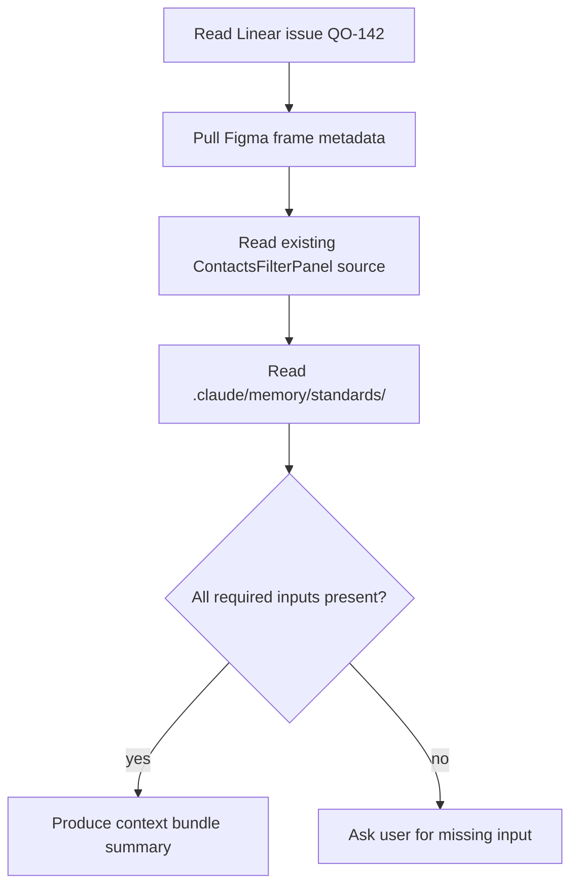
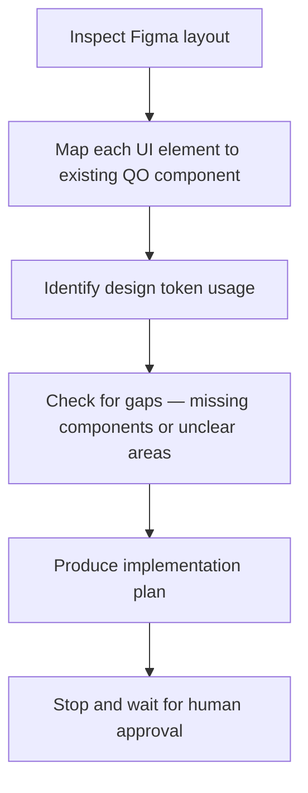
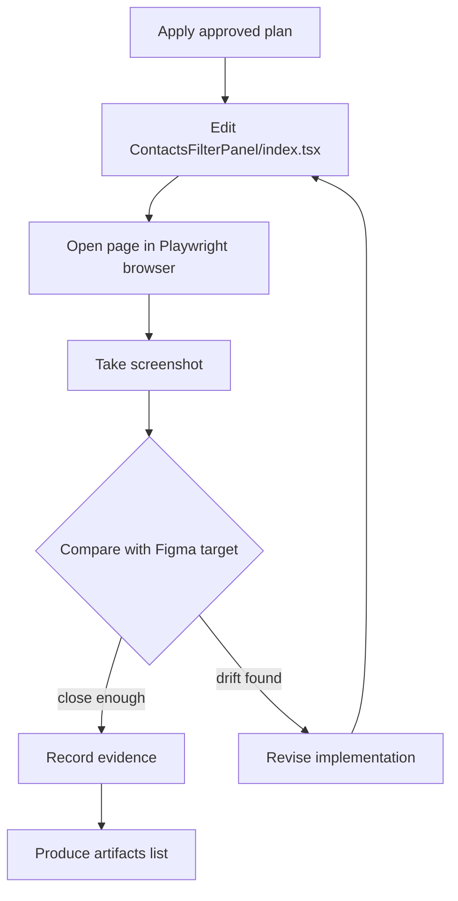
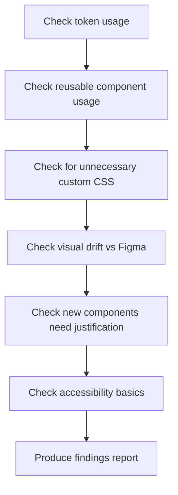
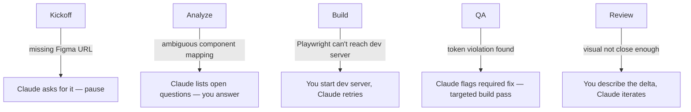

# Workflow Simulation — Queen One Supervised UI Delivery

This document walks through a real-feeling end-to-end example of the supervised UI workflow so you can understand what happens at each step, what Claude does, what you do, and what gets produced.

> **Test the diagrams live**: copy any `flowchart` block below and paste it at [mermaid.live](https://mermaid.live) to render and explore it interactively.

---

## The Scenario

**Task**: Reskin the Campaign Contacts filter panel to match a new Figma design.

The filter panel currently uses hardcoded colours and ad hoc spacing. The new Figma design replaces those with proper Queen One design tokens and introduces an `OrionToggleButtonGroup` for the filter type selector.

This is a bounded, realistic task — one screen area, clear Figma reference, existing components should cover most of it.

---

## Full Flow at a Glance

```mermaid
flowchart LR
    A[Linear issue\nready] --> B[/qo-ui-kickoff\nContext assembly]
    B --> C[/qo-ui-analyze\nComponent map + plan]
    C --> D{Human approval}
    D -- approved --> E[/qo-ui-build\nImplement + Playwright loop]
    D -- needs changes --> C
    E --> F[/qo-ui-qa\nAudit]
    F --> G[/qo-ui-report\nHandoff summary]
    G --> H{Human review}
    H -- accepted --> I[Linear: Done\nPR opened]
    H -- iterate --> E
```

---

## Step 0 — The Linear Issue

Before you run anything, the Linear issue should contain:

```
Title:   Reskin Campaign Contacts filter panel

Description:
  The current filter panel uses hardcoded hex colours and manual padding.
  Update to use Queen One design tokens and replace the filter type
  selector with OrionToggleButtonGroup.

Figma URL:
  https://www.figma.com/file/XXXX/QueenOne?node-id=1234

Visual reference:
  [screenshot attached — current state]
  [screenshot attached — Figma target]

Acceptance criteria:
  - filter type selector uses OrionToggleButtonGroup
  - all colours reference theme.palette tokens (no hardcoded hex)
  - spacing uses theme.spacing() throughout
  - visual output matches Figma within normal tolerance
  - no new bespoke styled components introduced

Scope:
  src/features/campaigns/components/ContactsFilterPanel/

Non-goals:
  - filter logic changes
  - backend API changes
```

If any of these are missing, `/qo-ui-kickoff` will stop and ask before proceeding.

---

## Step 1 — `/qo-ui-kickoff`

**What you do**: Run `/qo-ui-kickoff QO-142` (or paste the issue URL).

**What Claude does**:



Claude produces a short context summary:

```
Context bundle — QO-142

Linear: requirements and acceptance criteria confirmed
Figma:  frame node-id=1234 fetched — filter panel layout, token references visible
Visual reference: current state screenshot available, target Figma screenshot available
Source: src/features/campaigns/components/ContactsFilterPanel/index.tsx found
Standards: connectui-design-system.md, connectui-stack.md loaded

Missing inputs: none

Ready for /qo-ui-analyze
```

**What you do**: Read the summary. If it looks right, run `/qo-ui-analyze`.

---

## Step 2 — `/qo-ui-analyze`

**What Claude does**:



Claude produces a structured analysis:

```
Requirement summary
  Replace hardcoded values with tokens. Replace custom toggle with
  OrionToggleButtonGroup. No logic changes.

Layout summary
  - Header row: filter label + OrionToggleButtonGroup (All / Active / Paused)
  - Body: 3 filter chips using MUI Chip
  - Footer: clear-all button using MUI Button text variant

Reusable component map
  ┌─────────────────────────────┬─────────────────────────────────┐
  │ UI element                  │ Component                       │
  ├─────────────────────────────┼─────────────────────────────────┤
  │ Filter type selector        │ OrionToggleButtonGroup (exists) │
  │ Filter chips                │ MUI Chip (use sx with tokens)   │
  │ Clear all                   │ MUI Button variant="text"       │
  │ Panel container             │ MUI Box + theme.spacing()       │
  └─────────────────────────────┴─────────────────────────────────┘

Token guidance
  Background: theme.palette.background.paper
  Border:     theme.palette.divider
  Chip bg:    theme.palette.queen[100]
  Chip text:  theme.palette.queen[700]
  Spacing:    theme.spacing(1), theme.spacing(2), theme.spacing(3)

Gaps
  - OrionToggleButtonGroup accepts value + onChange — need to confirm
    the correct prop shape matches what the panel's state provides

Implementation plan
  1. Replace top-level container styles with theme.spacing() and tokens
  2. Replace filter type <select> with OrionToggleButtonGroup
  3. Replace Chip hardcoded sx values with token references
  4. Replace clear-all inline styles with MUI Button + token sx
  5. Remove all hardcoded hex strings

Open questions
  Q1: OrionToggleButtonGroup exclusive or multi-select mode here?
      (Figma shows single-select — assuming exclusive=true)

Awaiting your approval to proceed to build.
```

**Human decision point**: You read the component map and plan. You either:

- **Approve** → `looks good, proceed`
- **Adjust** → `Q1: yes, exclusive mode is correct. Also add aria-label to the toggle group.`
- **Reject** → rarely needed at this stage

Claude does not write any implementation code until you approve.

---

## Step 3 — `/qo-ui-build`

**What Claude does**:



Claude works through the implementation pass, then opens the page in Playwright and captures a screenshot. It compares visually:

```
Build pass 1

Changes made:
  - Replaced <select> with OrionToggleButtonGroup (exclusive mode, aria-label added)
  - Replaced container sx with theme.spacing(2) padding + background.paper
  - Replaced 6 hardcoded hex values with palette token references
  - Removed 2 inline style props

Playwright screenshot taken → .claude/memory/reports/qo-142-build-pass-1.png

Visual comparison:
  - Toggle group: matches Figma ✓
  - Chip background: close — currently queen[200], Figma shows queen[100]
  - Chip border radius: 4px vs Figma 6px — adjusting

Revising chips…
```

After revision:

```
Build pass 2

Changes:
  - Chip bg corrected to queen[100]
  - Chip borderRadius set to theme.shape.borderRadius * 1.5 (= 6px with default theme)

Playwright screenshot taken → .claude/memory/reports/qo-142-build-pass-2.png

Visual comparison:
  - All elements match Figma within normal tolerance ✓
  - No obvious regressions on surrounding panel elements

Reused components:   OrionToggleButtonGroup, MUI Chip, MUI Button, MUI Box
New components:      none
Deviations:          none (chip borderRadius uses theme multiplier, not hardcoded)

Ready for /qo-ui-qa
```

---

## Step 4 — `/qo-ui-qa`

**What Claude does**: Runs a standards audit against the built output.



Example QA findings:

```
QA Report — QO-142

Verdict: PASS (1 warning)

Token usage
  PASS — all colour references use palette tokens
  PASS — all spacing uses theme.spacing()

Component reuse
  PASS — OrionToggleButtonGroup used correctly
  PASS — no bespoke styled components introduced

Custom CSS
  PASS — no ad hoc CSS files or emotion strings outside sx

Visual drift
  PASS — screenshot matches Figma within tolerance
  WARN — chip font size is 12px in render, 13px in Figma
         (not a required fix — within acceptable tolerance,
          note for designer review)

Accessibility
  PASS — toggle group has aria-label
  PASS — chips have readable contrast

Required fixes:  none
Suggested fixes: confirm chip font size with designer (1px delta)
```

---

## Step 5 — `/qo-ui-report`

Claude produces a Linear-ready summary:

```
Implementation Summary — QO-142

What was done:
  Reskinned ContactsFilterPanel to use Queen One design tokens and
  OrionToggleButtonGroup. All hardcoded values removed.

Reused components:
  - OrionToggleButtonGroup
  - MUI Chip (with token sx)
  - MUI Button (text variant)
  - MUI Box (token spacing)

New components: none

Deviations: none (chip borderRadius uses theme multiplier)

QA verdict: PASS (1 cosmetic warning — chip font size 1px delta, flagged for designer)

Screenshots:
  - .claude/memory/reports/qo-142-build-pass-2.png

Linear milestone update (ready to post):
  "Filter panel reskin complete. All tokens applied, OrionToggleButtonGroup
   integrated, QA passed. One cosmetic note for designer (chip font 12 vs 13px).
   Ready for review."
```

---

## Step 6 — Human Review

**What you do**:

1. Open the screenshots
2. Open the running UI in the browser
3. Read the QA findings
4. Decide: accept, iterate, or narrow scope

**Accept path**:
- Post the Linear milestone update from the report
- Open a PR or merge directly depending on team workflow

**Iterate path**:
- Give Claude one specific correction: `increase chip font to 13px`
- Claude runs `/qo-ui-build` again (targeted pass, not full rebuild)
- Playwright re-captures
- QA re-runs
- Report updates

```mermaid
flowchart LR
    A[Human review] --> B{Decision}
    B -- accept --> C[Post Linear update]
    C --> D[Open PR]
    B -- iterate --> E[One specific correction]
    E --> F[/qo-ui-build targeted pass]
    F --> G[/qo-ui-qa]
    G --> A
```

---

## What Gets Produced

At the end of a clean run:

| Artifact | Location |
|---|---|
| Context bundle summary | conversation output |
| Component map + plan | conversation output |
| Build screenshots | `.claude/memory/reports/` |
| QA findings report | conversation output |
| Linear milestone update | conversation output (ready to copy-paste) |
| Code changes | real target files in the feature directory |

---

## The Rules That Run This

| Rule | Where it lives | What it enforces |
|---|---|---|
| No build before approval | `guardrails.md` | Claude waits after analysis |
| Reuse components first | `guardrails.md` | Component map always produced before code |
| Playwright mandatory | `guardrails.md` | Screenshot required before QA |
| Tokens first | `frontend.md` | sx props use palette/spacing tokens |
| No done without human review | `guardrails.md` | Claude produces handoff, human approves |

---

## What a Broken Run Looks Like

A run can stall or degrade at several points. Here is what each failure looks like and how to recover.



Recoveries are always bounded — one issue at a time, no silent workarounds.

---

## Key Things to Know Before Your First Run

1. **Start dev server first** — Playwright needs a running local server to take screenshots. Start it before `/qo-ui-build`.
2. **Linear issue must be sufficiently filled** — kickoff will stop and ask if required fields are missing.
3. **Figma and GitHub tokens must be set** — `FIGMA_API_KEY` and `GITHUB_PERSONAL_ACCESS_TOKEN` in your environment.
4. **One task at a time** — the workflow is designed for one bounded issue, not multiple simultaneous screens.
5. **You own the approval gates** — Claude will not proceed past analysis without your explicit approval.
